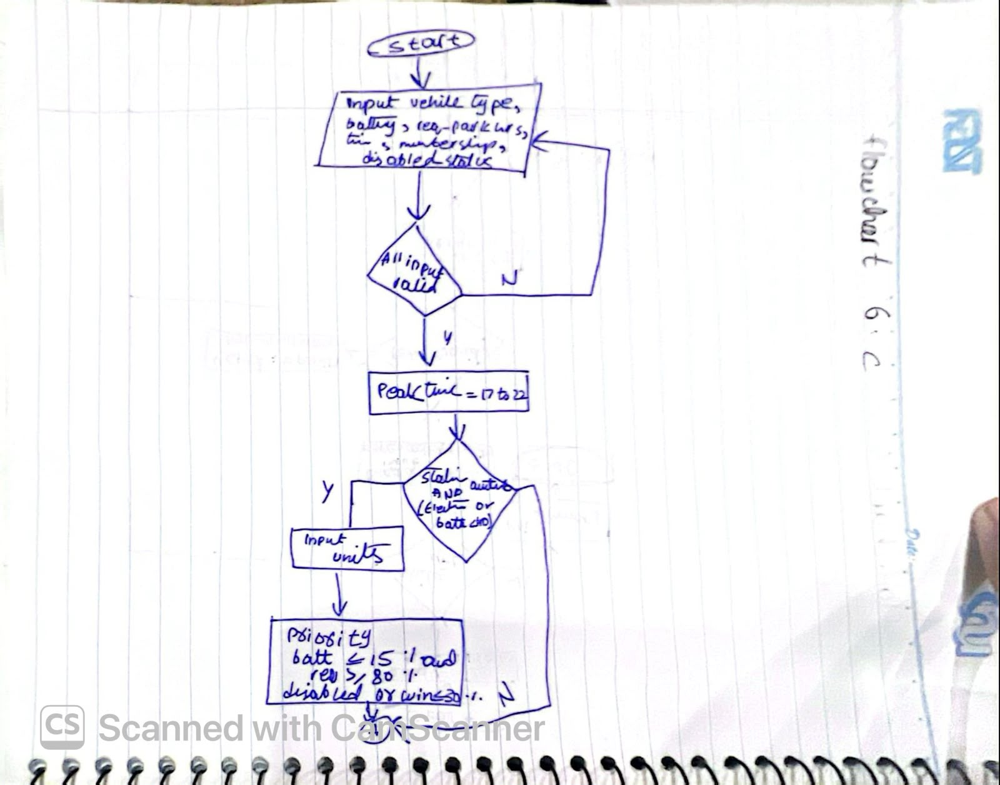
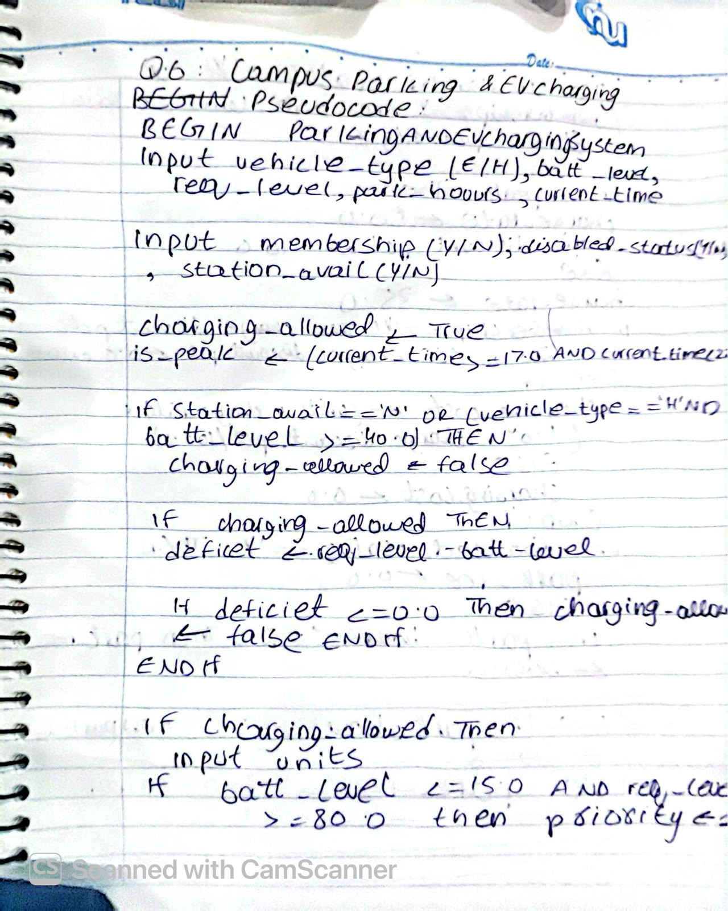
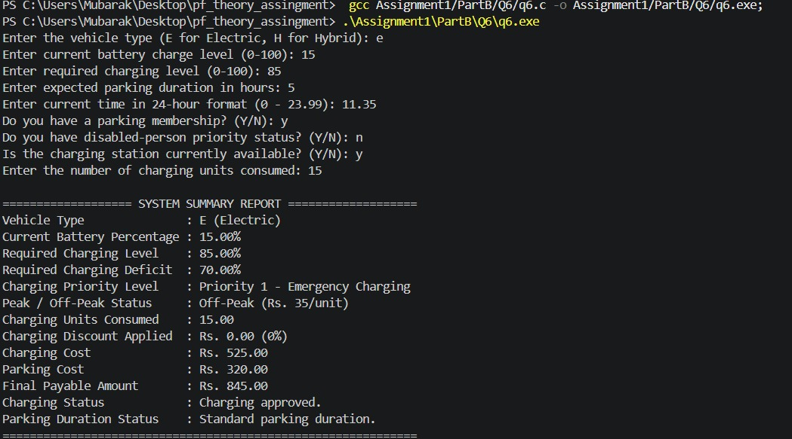

# Question Details

## Code Solution
The C source code is available in `q6.c`.

## Flowcharts & Logic
### Flowchart - Page 1

### Flowchart - Page 2
.jpeg)

## Algorithm / Pseudocode

.jpeg)
.jpeg)

## Output / Execution Proof
